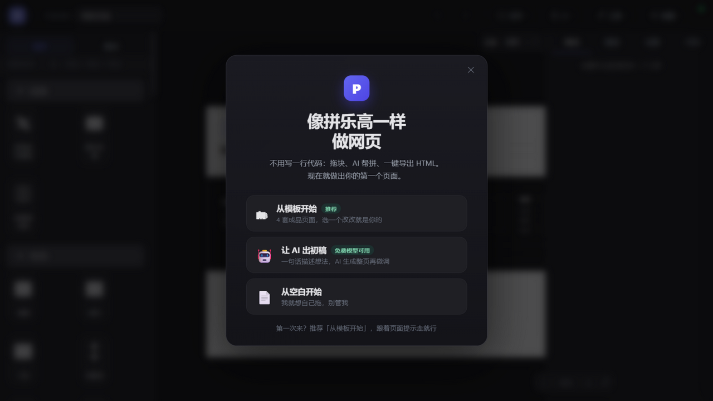
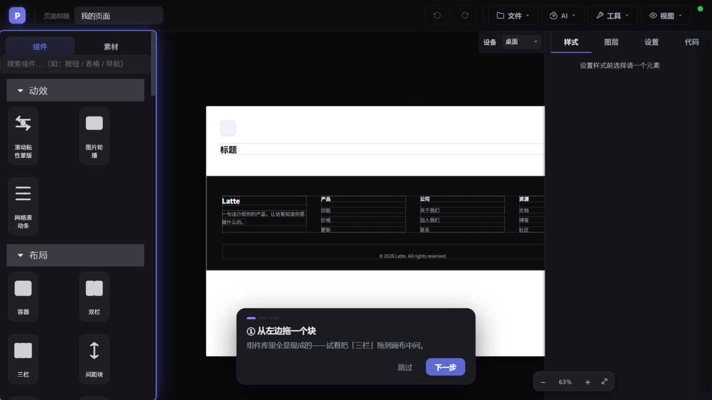

# PageForge · 可视化网页设计器

> 拼乐高一样做网页：拖块、AI 帮拼、一键导出 HTML——不用写一行代码。



**PageForge** 是一个面向非程序员的中文可视化网页编辑器：左侧 51 个现成组件块，中间画布拖拽拼装，右侧即时改样式，AI 助手能听懂"加个页脚""整页换配色"并直接动手。做完一键导出**独立的单文件 HTML**，放哪都能打开，零锁定。



## 特性

- 🧱 **51 个组件块**：布局 / 内容 / 表单 / 定价表 / 时间线 / 苹果风设计块 / 电商块，拖进画布即用
- 🤖 **AI 三级拼装管线**（省 token 的关键设计）：
  1. 规则层零 token 直取——"加个页脚"类高频请求不调用模型
  2. 模型按块目录选块填槽（~30 token）——不写 HTML，样式永远是库里调好的
  3. 目录没有才自由生成，自动记入缺口日志供模块库进化
- 🌐 **多模型适配**：DeepSeek / 智谱 GLM（有免费模型）/ Kimi / 通义 / 硅基流动 / OpenAI / 自定义端点，OpenAI 兼容协议一键切换
- 🎨 **智能配色 + 一键换肤**：5 套主题皮肤、AI 配色生成、对比度自动修正
- 📄 **多页面**：站内锚点跳转，一键导出整站
- 🗂 **模板库 + 素材库**：4 套成品模板（真实缩略图）、39 图标 + 22 插画 + 文案库，全部离线内置
- 📤 **单文件导出**：独立 HTML、favicon + Open Graph 分享卡，发微信有预览
- 🖥 **三种形态**：桌面 exe（免安装）/ 单文件网页版 / 本地 dev

## 快速开始

**方式一（最简单）**：下载 `PageForge.exe`（Windows 免安装）或 `PageForge.html`（浏览器直接打开）。

**方式二（开发模式）**：

```bash
npm install
npm run dev        # 打开 http://localhost:5173
npm run regression # 20 项端到端回归（自起 headless Edge）
```

### 配置 AI（可选）

点编辑器右上角 **⚙**，选服务商、填 API Key。推荐**智谱 GLM** 的 `glm-4-flash-250414`——[免费](https://open.bigmodel.cn)，调试零成本。不配置也能用全部手动功能。

## 它是怎么工作的

```
用户说"加个页脚" ──► 规则层命中？──是──► 直接插入（0 token）
                        │否
                        ▼
                 模型按块目录选块填槽（~30 token）
                        │目录里没有
                        ▼
                 自由生成 + 记入缺口日志 ──► 高频缺口结晶为新块
```

模块库就是 AI 的工具集：每加一个块，人和 AI 都能用。完整思路见 [docs/模块飞轮.html](docs/模块飞轮.html)。


## 技术栈

原生 JS + [GrapesJS](https://github.com/GrapesJS/grapesjs) + Vite + Electron（桌面版）+ html2canvas。零框架依赖，构建产物为单文件 HTML。

## 路线图

- [ ] 缺口日志查看/导出（模块库进化的人工审入口）
- [ ] 高频块槽位扩容
- [ ] 任务模式（AI 多步编排，做一步看一步）
- [ ] 全局设计令牌 / ARIA 无障碍

## License

暂未设置，计划以 MIT 开源。
